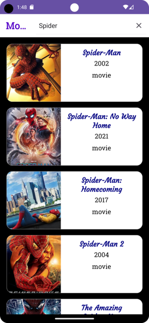

# Movie App

## Description

Movie App is a simple Android application built in Kotlin that allows users to search for movies based on title and view movie details. It uses the OMDB API to fetch movie data.

## App Features

- Search for movies by title.
- View a list of search results.
- Tap on a movie to see its details, including the title, year, poster, and plot.

## Known Issues

1. **Limited Search Functionality:** The app currently has limited search functionality due to API constraints. You can only search for movies with titles of three or more letters. This is a limitation imposed by the OMDB API.

2. **No Direct Movie Retrieval:** Due to API issues, the app cannot fetch movies directly. Instead, it uses a keyword-based search, which may not provide the exact movie you're looking for if the title is short or common.

## ScreenShots

